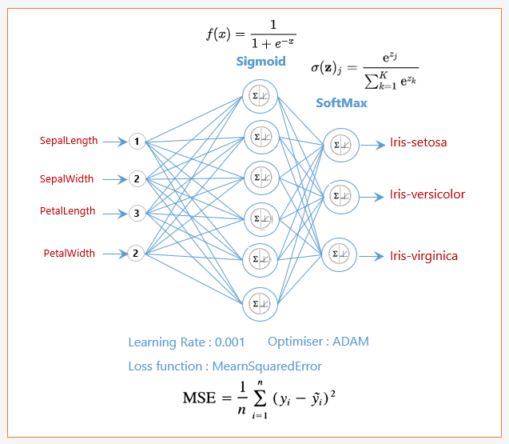

# Deep Learning For Java (DL4J)

[https://deeplearning4j.konduit.ai/](https://deeplearning4j.konduit.ai/)


## Definition

**Deep Learning 4 java** est un framework open source (licence apache) qui permet de construire, entrainer et tester une grande diversite d'algorithmes de Deep Learning (depuis les reseaux standard, jusqu'aux reseau concolutionels, en passant par des architectures plus complexes).

Il se base sur sa structure de donnees (Nd4j) permettant d'effectuer les operations de l'algebres lineaires sur les architectures massivement paralleles GPU et les architectures distribuees.

**Nd4j** utilise du code natif (Cuda), et alloue de l'espace or du tas Java. Ceci est imperativement a prendre en compte lorsque la volumetrie des donnees est importante.

DL4J utilise **DataVec** pour la vectorisation et la transformation des donnes.

## But de l'application

Le but est de creer un modele d'entrainement supervise a l'aide du dataset Iris. Le dataset fournis 120 instances (120 lignes) d'exemples de donnees de fleurs, classees en 3 types de fleurs (iris-setosa, iris-versicolor et iris virginica) et pour chaque type de fleurs nous avons 4 carateristiques (SepalLength, SepalWidth, PetalLength et PetalWidth)


## Description du dataset (iris-train.csv)

* La 1er colonne correspond au sepalLength
* La 2eme au sepalWidth
* La 3eme au petalLength
* La 4eme au petalWidth
* La 5eme correspond au type de fleurs (0 pour setosa, 1 pour versicolor et 2 pour virginica)

## Retour sur le modele

Le modele de reseau de neuronnes que nous allons creer, et un multilayer perceptron.

>Un multilayer perceptron ou perceptron multicouche (multilayer perceptron MLP) est un type de reseau neuronal artificiel organise en plusieurs couches au sein desquelles une information circule de la couche d'entree vers la couche de sortie uniquement ; il s'agit donc d'un reseau a propagation directe (feedforward). Chaque couche est constituee d'un nombre variable de neurones, les neurones de la derniere couche (dite « de sortie ») etant les sorties du systeme global.


**Modele MLP**



Ce MLP sera compose de 3 couches:

* l'input ou il y a 4 entrees
* une couche masquee, Sigmoid, ou nous utiliserons un certain nombre de neuronnes (10, 20, 30 ...) pour verifier la precision des modeles.
* output, SoftMax, ou il y a 3 sortie, correspondants a la probabilite que la sortie soit un iris setosa, ou versicolor ou virginica.

Nous utiliserons plusieurs parametrage, par exemple pour :

* La couche masquee nous utiliserons une fonction d'activation de sigmoid:

>En mathematiques, la fonction sigmoide (dite aussi courbe en S1) represente la fonction de repartition de la loi logistique. Elle est souvent utilisee dans les reseaux de neurones parce qu'elle est derivable, ce qui est une contrainte pour l'algorithme de retropropagation de Werbos. La forme de la derivee de sa fonction inverse est extrêmement simple et facile a calculer, ce qui ameliore les performances des algorithmes.
La courbe sigmoide genere par transformation affine une partie des courbes logistiques et en est donc un representant privilegie.

* pour la couche de sortie nous utiliserons une fonction d'activation de softMax. Nous permettant de nous donner la probabilite que l'exemple fournis appartiens bien a une classe precise (type d'iris), si l'on fait la sommes des sortie celle-ci sera egale a 1.

>En mathematiques, la fonction softmax, ou fonction exponentielle normalisee, est une generalisation de la fonction logistique qui prend en entree un vecteur.
En theorie des probabilites, la sortie de la fonction softmax peut être utilisee pour representer une loi categorielle – c’est-a-dire une loi de probabilite sur K differents resultats possibles.
La fonction softmax est egalement connue pour être utilisee dans diverses methodes de classification en classes multiples, par exemple dans le cas de reseaux de neurones artificiels.

* Retropropagation du gradient (fonction MearnSquaredError et Optimiser: ADAM). Le principe est que l'on donne des exemples dont on connait la sortie. La sortie predite moins la sortie relle nous permet de determiner l'erreur (un delta). Il faut minimiser l'erreur en utilisant la fonction MearnSquaredError, cad, l'erreur quadratique.

>En statistiques, l’erreur quadratique moyenne d’un estimateur d’un parametre de dimension 1 (mean squared error) est une mesure caracterisant la « precision » de cet estimateur. Elle est plus souvent appelee « erreur quadratique » (« moyenne » etant sous-entendu) ; elle est parfois appelee aussi « risque quadratique ».


>En statistiques, la retropropagation du gradient est une methode pour calculer le gradient de l'erreur pour chaque neurone d'un reseau de neurones, de la derniere couche vers la premiere. De façon abusive, on appelle souvent technique de retropropagation du gradient l'algorithme classique de correction des erreurs base sur le calcul du gradient grâce a la retropropagation et c'est cette methode qui est presentee ici. En verite, la correction des erreurs peut se faire selon d'autres methodes, en particulier le calcul de la derivee seconde. Cette technique consiste a corriger les erreurs selon l'importance des elements qui ont justement participe a la realisation de ces erreurs. Dans le cas des reseaux de neurones, les poids synaptiques qui contribuent a engendrer une erreur importante se verront modifies de maniere plus significative que les poids qui ont engendre une erreur marginale.
Ce principe fonde les methodes de type algorithme du gradient, qui sont efficacement utilisees dans des reseaux de neurones multicouches comme les perceptrons multicouches. L'algorithme du gradient a pour but de converger de maniere iterative vers une configuration optimisee des poids synaptiques. Cet etat peut être un minimum local de la fonction a optimiser et idealement, un minimum global de cette fonction (dite fonction de coût).
Normalement, la fonction de coût est non lineaire au regard des poids synaptiques. Elle dispose egalement d'une borne inferieure et moyennant quelques precautions lors de l'apprentissage, les procedures d'optimisation finissent par aboutir a une configuration stable au sein du reseau de neurones.

* Vitesse d'apprentissage : Learning Rate à la valeur de 0.001.


# Initialisation du projet

* Creation d'un projet Maven


```xml
<project xmlns="http://maven.apache.org/POM/4.0.0"
	xmlns:xsi="http://www.w3.org/2001/XMLSchema-instance"
	xsi:schemaLocation="http://maven.apache.org/POM/4.0.0 https://maven.apache.org/xsd/maven-4.0.0.xsd">
	<modelVersion>4.0.0</modelVersion>
	<groupId>com.ruffin</groupId>
	<artifactId>dl4j</artifactId>
	<version>0.0.1-SNAPSHOT</version>
	<name>Deep Learning for Java</name>
	<properties>
		<maven.compiler.source>15</maven.compiler.source>
		<maven.compiler.target>15</maven.compiler.target>
		<project.build.sourceEncoding>UTF-8</project.build.sourceEncoding>
		<project.reporting.outputEncoding>UTF-8</project.reporting.outputEncoding>
	</properties>
	<dependencies>
		<!--Coeur de DL4J -->
		<dependency>
			<groupId>org.deeplearning4j</groupId>
			<artifactId>deeplearning4j-core</artifactId>
			<version>1.0.0-beta3</version>
		</dependency>
		<!--ND4J Natif pour CPU -->
		<dependency>
			<groupId>org.nd4j</groupId>
			<artifactId>nd4j-native-platform</artifactId>
			<version>1.0.0-beta3</version>
		</dependency>
		<!--User Interface de DL4J -->
		<dependency>
			<groupId>org.deeplearning4j</groupId>
			<artifactId>deeplearning4j-ui_2.11</artifactId>
			<version>1.0.0-beta3</version>
		</dependency>
		<dependency>
			<groupId>org.slf4j</groupId>
			<artifactId>slf4j-simple</artifactId>
			<version>1.6.1</version>
		</dependency>
	</dependencies>
</project>
```


* Ajout d'un fichier Readme et gitignore

* Initialisation depot git

```cmd
cd dl4j
git init
git add .
git commit -am "init projet"
```

* Creation d'un repository dans github

* Faire le lien entre le repository local et Github

```cmd
git branch -M main
git remote add origin https://github.com/jeanyvesruffin/DeepLearning4Java.git
git push -u origin main
```


